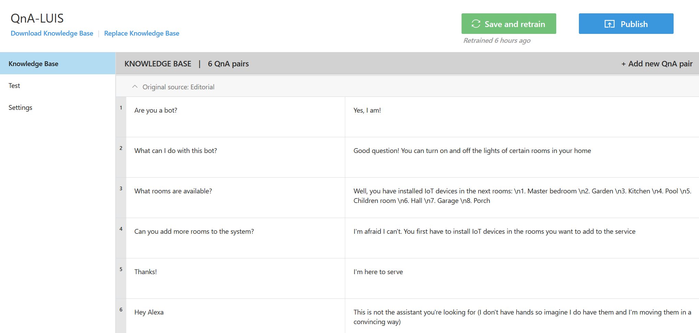
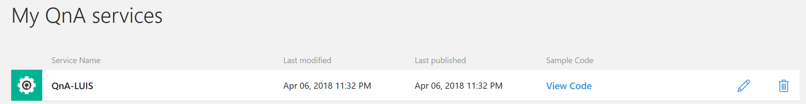
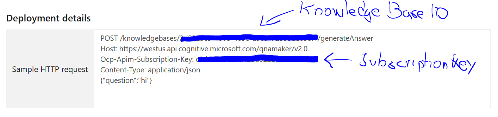
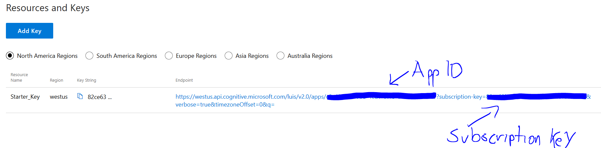

# How to use QnA Maker and LUIS in the same bot #
This is a sample on how to integrate LUIS and QnA Maker services from Microsoft Azure with the Azure Bot Service

><b>Disclosure</b>. This repo asumes that you have already worked with Bots, QnA and/or LUIS before. If you haven't then these tutorials will sure be useful as we won't cover the basic parts of such services. Please check them first and come back here to learn how to use both services in the same bot: [Azure Bot Service documentation](https://azure.microsoft.com/en-us/services/bot-service/), [Create your first LUIS App](https://docs.microsoft.com/en-us/azure/cognitive-services/luis/luis-get-started-create-app) and [Create your first QnA Maker service](https://qnamaker.ai/Documentation/CreateKb)


## Quick summary ##
We're constantly faced with scenarios where we need both LUIS and QnA working together and while it should be easy I haven't seen many examples out there. Here's a quick way to do it calling a QnA service first and if the service doesn't have any response then it calls LUIS to get intents and answer the user

## Architecture ##
//Insert architecture here

## The staged scenario ##
For this example, the chat bot will use LUIS to help a user to:
- "turn on" and "turn off" the lights from different rooms of a house and also give random greetings everytime the user says hi to the bot.

At the same time, the bot will use QnA Maker to answer basic questions like:
- "Are you a bot?"
- "What rooms are available to turn on or off?"
- "Can you add a new room to the service?"

### Creating the QnA Maker service ###
>NOTICE. For this example we won't be creating <b><i>the ultimate</i></b> QnA Maker service altough nothing stops you to get creative. 

For simplicity purposes I created a QnA Maker service wit a handful of questions, just to see that my bot is connecting to the service and retrieving some answers. Here's a screenshot of what I did:



That's it. Just quick steps:
- Created a new QnA Service
- Created 6 pairs of questions and answers
- Clicked on "Save and retrain" the service
- Published the service
- Saved the <i>QnA Maker SubscriptionKey</i> and <i>QnA Maker Knowdledge Base ID</i> to my bot webconfig file. If you don't remember how / where to save these values just go again to the [QnA Maker website](https://qnamaker.ai/Home/MyServices) and you'll see a list of all the QnAs you have created. You'll see a list of Services like this one:

  

Just click on the <i>pencil icon</i> and once you are on our service click on <i>"Settings"</i> at the left menu. Once there you'll see a <i>"Deployment details"</i> section almost at the bottom of the page and there you'll see your service ID and subscription key:



Now that you have you credentials go to your Bot code and locate the file Web.Config (usually it's the last file at the project). Open it and locate the <i><appSettings></i> section. Within create two new keys for your QnA credentials. You should have something like this:

```xml
<appSettings>
    <add key="BotId" value="YourBotId" />
    <add key="MicrosoftAppId" value="" />
    <add key="MicrosoftAppPassword" value="" />
    <add key="QnAMakerSubscriptionKey" value="YOUR_QNA_SUBSCRIPTION_KEY_GOES_HERE" />
    <add key="QnAMakerKnowledgeBaseId" value="YOUR_QNA_KNOWLEDGE_BASE_ID_GOES_HERE" />
  </appSettings>
```
You're set! At least from a service and credentials perspective. Don't worry about the code as we'll touch it later.

### Creating the LUIS App ###
Same as with QnA. The LUIS app we'll create is not about its complexity regarding # of intents or entities. We'll stick to basics defining:
- 3 intents: "Greeting", "TurnOn" and "TurnOff
- 2 entities: "Time" and "Date"

>TIP. You don't have to follow this repo through and through. Instead of playing with turning the lights on and off you could bring your own intents and entities

#### Analizing the intents ####
##### Greeting #####
This intent has nothing but samples of different ways to greet a person. If the user writes things like "hi", "good morning", "hello there" and similars then we'll take them as all as greetings

###### TurnOn #####
 Takes utterances that involve keywords that are invoke the same action as turning the lights:
 - "Turn the lights from the [room]"
 - Power up the [room] lights
 - Can you start the lights at the [room]?
 - Please, help me starting the [room] lights
 - Start the [room] lights at [time]
 - etc.
###### TurnOff #####
Opposite of the TurnOn intent. Is composed of utterances that follow these similar patterns:
- Turn off the [room] lights
- Stop the [room] lights
- Please turn off the lights at the [room]
- Power off the [room] at [time]
- Can you please shut the [room] lights at [time]?

#### Analizing the entities ####
Did you notice we had blank spaces in the previous statements?
- "Turn off the <i>[room]</i> at <i>[time]</i>
- "Please start the lights from the <i>[room]</i> at <i> [time]</i>

Well, those are our two entities:
- Room: Will help us identify the rooms named in the TurnOn and TurnOff intents
- Time: Will help us identify the hour/date that our user wants the bot to turn on/off the light

Again, it's not the most complex LUIS scenario but this was on purpose to just grab a functional QnA Service and functional LUIS App and mix them

#### Training the LUIS App ####
It shouldn't take us more than 30 minutes to train our LUIS App with more than a handful of utterances. These are some the utterances I used to train my app:

##### Greeting intent #####
```console
good morning
top of the morning to ya
good afternon
hello there
good afternoon
```
##### TurnOn intent #####
``` console
please turn on the [Room] lights
turn the [Room] lights on
start the [Room] lights
can you turn on the [Room] lights ?
please start up the [Room]
get the Room lights [going]
cna you turn un the lights from the [Room]?
please turn on the [Room] lights
turn on the [Room] lights at [Time]
please start the [Room] lights at [Time] 
```
##### TurnOff intent #####
```console
turn off the [Room] lights
power off the [Room]
can you please stop the lights from the [Room]
kill the [Room] lights
please turn off the lights from the [Room] at [Time]
stop the [Room] lights at [Time]
kill the [Room] lights at [Time] 
```
#### Setting the LUIS credentials into our bot ####
Don't forget to add your LUIS credentials to the webconfig file. You'll find your App ID and Subscription key on your [LUIS app's site](https://www.luis.ai/applications) at the <i>Publish</i> tab on the upper right side of the page. Once there, you'll see a <i>"Resources and Keys"</i> section and you'll find your credentials in a query string:



Let's go to our webconfig file again and update it wirh our LUIS credentials:

```xml
<appSettings>
    <add key="BotId" value="YourBotId" />
    <add key="MicrosoftAppId" value="" />
    <add key="MicrosoftAppPassword" value="" />
    <add key="LuisSubscriptionKey" value="YOUR_LUIS_SUBSCRIPTION_KEY_GOES_HERE" />
    <add key="LuisApplicationId" value="YOUR_LUIS_APPLICATION_ID_GOES_HERE" />
    <add key="QnAMakerSubscriptionKey" value="YOUR_QNA_SUBSCRIPTION_KEY_GOES_HERE" />
    <add key="QnAMakerKnowledgeBaseId" value="YOUR_QNA_KNOWLEDGE_BASE_ID_GOES_HERE" />
  </appSettings>
```
## Coding time ##
### Setting up the bot ###
I like to clean up the MessageController code as we won't be handling a lot of activity types most of the times. In fact, for this demo we'll only play around with two types of activities: <b>Message</b> and <b>ConversationUpdate</b>. The MessagesController code goes like this:
```csharp
using System.Net;
using System.Net.Http;
using System.Threading.Tasks;
using System.Web.Http;
using BotIntegrationWithQnA_LUIS.Utilities;
using Microsoft.Bot.Builder.Dialogs;
using Microsoft.Bot.Connector;
using System.Linq;


namespace BotIntegrationWithQnA_LUIS
{
    [BotAuthentication]
    public class MessagesController : ApiController
    {
        public async Task<HttpResponseMessage> Post([FromBody]Activity activity)
        {
            switch (activity.Type)
            {
                case ActivityTypes.Message:
                    await Conversation.SendAsync(activity, () => new Dialogs.RootDialog());
                    break;
                case ActivityTypes.ConversationUpdate:
                    if (activity.MembersAdded.Any(o => o.Id == activity.Recipient.Id))
                        await BotUtilities.DisplayWelcomeMessage(activity, "Welcome! I'll be your bot guide");
                    break;
            }
            return Request.CreateResponse(HttpStatusCode.OK);
        }
    }
}
```
Simply put: Everytime a user joins to chat with the bot it will see a welcome message. And after that everytime the user writes something that message will re route to our RootDialog class.

### Utilities folder ###
I have this Utilities folder to include things that are useful throught the bot journey such as the DisplayWelcomeMessage method that could also serve to show a menu everytime a user types in keywords like "Start", "Menu", "Main Menu" and others. You could catch those keyworkds at the Post method at MessagesController.cs and then reroute the user to a main menu. But that is work for other day. Let's stick to the DisplayWelcomeMessage method in the BotUtilities class:
```csharp
using Microsoft.Bot.Connector;
using System;
using System.Collections.Generic;
using System.Threading.Tasks;

namespace BotIntegrationWithQnA_LUIS.Utilities
{
    public class BotUtilities
    {
        public static async Task DisplayWelcomeMessage(Activity activity, string message)
        {
            Activity replyMessage = activity.CreateReply("");
            ConnectorClient client = new ConnectorClient(new Uri(activity.ServiceUrl));

            HeroCard card = new HeroCard();
            card.Title = message;

            List<CardImage> cardImages = new List<CardImage>();
            cardImages.Add(new CardImage(url: "https://c.s-microsoft.com/en-us/CMSImages/ImgTwo.jpg?version=2432BB03-C90E-EF03-A2BB-BFA093E1A899"));
            card.Images = cardImages;

            replyMessage.Attachments.Add(card.ToAttachment());
            await client.Conversations.ReplyToActivityAsync(replyMessage);
        }
    }
}
```
The DisplayWelcomeMessage method just displays a HeroCard with an image and a message for the user. For this demo I'm receiving the message we want to display as a parameter and by default the image displayed is the logo from Microsoft.

### QnA Dialog ###
Bot Framework provides an easy way to use QnA services through the [<b>QnAMakerDialog class</b>](https://github.com/Microsoft/BotBuilder-CognitiveServices/blob/master/CSharp/Library/QnAMaker/QnAMaker/QnAMakerDialog.cs). This class has a constructor that primarily receives the credentials from an existing QnAService and then proceeds to handle the conversation trhough a series of methods in the next order:
- StartAsync: Starts the dialog
- MessageReceivedAsync: 
    - Receives a message from the user and sends it to QnA using the private method <b>QueryServiceAsync</b>
    - If it receives an answer from the QnAService it checks if it is a valid answer with the method <b>IsConfidentAnswer</b>
    - If it is a confident answer, posts the answer to the user via the method <b>RespondFromQnAMakerResultAsync</b>
    - After, it finalizes with the interaction with method <b>DefaultWaitNextMessageAsync</b>
    - If it is not a confident answer it calls the method <b>QnAFeedbackStepAsync</b>
    - Then returns to conversate with the user through the method <b>ResumeAndPostAnswer</b>

The QnAMakerDialog does all this in behalf of us devs so in most cases initializing a new QnADialog should be more than enough to integrate QnA with our bot:
```csharp
[Serializable]
public class QnADialog : QnAMakerDialog
{
    public QnADialog() : base(
        new QnAMakerService (
            new QnAMakerAttribute(
                ConfigurationManager.AppSettings["QnAMakerSubscriptionKey"],
                ConfigurationManager.AppSettings["QnAMakerKnowledgeBaseID"])))
    {}
}
```
But this integration scenario with LUIS is not a common scenario. So we'll have to override some of the methods we mentioned earlier in order for our bots to play nice between the two services:
```csharp
[Serializable]
public class QnADialog : QnAMakerDialog
{
    public static bool foundResultInQnA;
    public QnADialog() : base(
        new QnAMakerService (
            new QnAMakerAttribute(
                ConfigurationManager.AppSettings["QnAMakerSubscriptionKey"],
                ConfigurationManager.AppSettings["QnAMakerKnowledgeBaseID"],
                "No good match found in the KB",
                0)))
    {}
}
```

Two things:
- First I added a boolean called <b>foundResultInQnA</b> that will helps us know if QnA got an answer for us or not 
- I overrided the "confidence" treshold to 0 in the dialog constructor and provide a default "no answer" reply for our user even though we won't use this reply. 

I needed to do this because the <b>IsConfidentAnswer</b> method returns a FALSE value when it detects that the best answer acquired has a confidence score below 0.99 OR if the difference between the confidences from the best answer and second best answer is greater than 0.20.

So what? If the <b>IsConfidentAnswer</b> method returns a false value then after a series of steps it will answer the user with a "No match found" message and what I want is the bot to navigate to LUIS when this happens.

So, now that the confidence threshold goes to 0 then the QnAMakerDialog will always go to the <b>RespondFromQnAMakerResultAsync</b> method and now it is time to override its code:
```csharp
protected override async Task RespondFromQnAMakerResultAsync(IDialogContext context, IMessageActivity message, QnAMakerResults result)
{
    var answer = result.Answers.First().Answer;

    if (answer == "No good match found in the KB")
        foundResultInQnA = false;

    else
    {
        foundResultInQnA = true;
        await context.PostAsync(answer);
    }
}
```
I ditched all the complexity that lies within this method to simply ask if the QnA Service has an anwer for me or not. By default, when a QnA Service doesn't find an answer on its knowledge base it returns a "No good match found in the KB" message and since I dropped to confidence threshold to 0 that means I'll always get this answer if my bot is not completely confident on an answer. 
If my bot has an answer then my boolean <b>foundResultInQnA</b> gets a TRUE value and the QnAMakerDialog will spost the answer straight to my user. If my QnA Service did not had an answer on his knowledge base then the boolean <b>foundResultInQnA</b> will get a false value and no answer to the user will be written (for now).
>NOTE. For this scenario, ditching the confidence threshold to 0 is fine but you might want to play with some different values and take different approaches depending on the bot you are writing.

```csharp
protected override async Task DefaultWaitNextMessageAsync(IDialogContext context, IMessageActivity message, QnAMakerResults result)
{
    IMessageActivity newMessage = context.MakeMessage();
    newMessage.Text = foundResultInQnA.ToString();
    context.Done<IMessageActivity>(newMessage);
}
```
I also overrided the <b>DefaultWaitNextMessageAsync</b> method to return the value from my boolean <b>foundResultInQnA</b>. This means that my main bot dialog will receive this result and will get to decide if the user has an answer to his question or if it should rise a LUIS Dialog :)

### LUIS Dialog ###

## Next steps ##

## References ##
1. [<b>QnAMakerDialog documentation</b>](https://github.com/Microsoft/BotBuilder-CognitiveServices/blob/master/CSharp/Library/QnAMaker/QnAMaker/QnAMakerDialog.cs) Really useful to understand what happens within the QnAMakerDialog class methods we often overlook in favor of a simple QnA implementation for our bot.